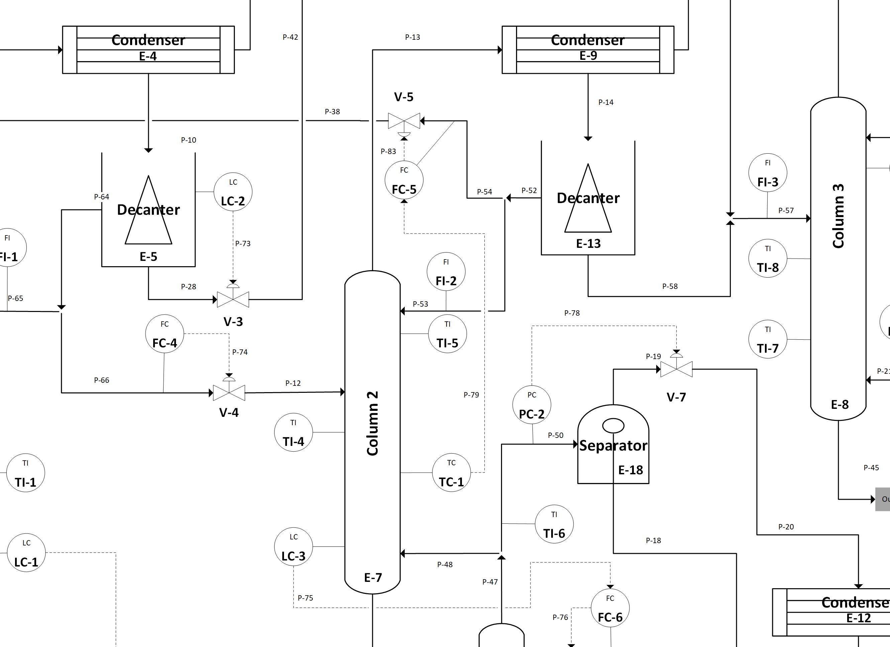
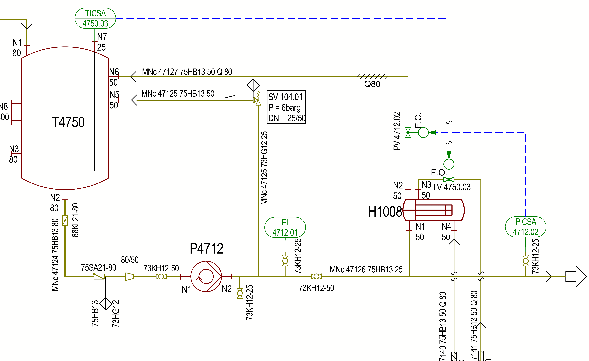
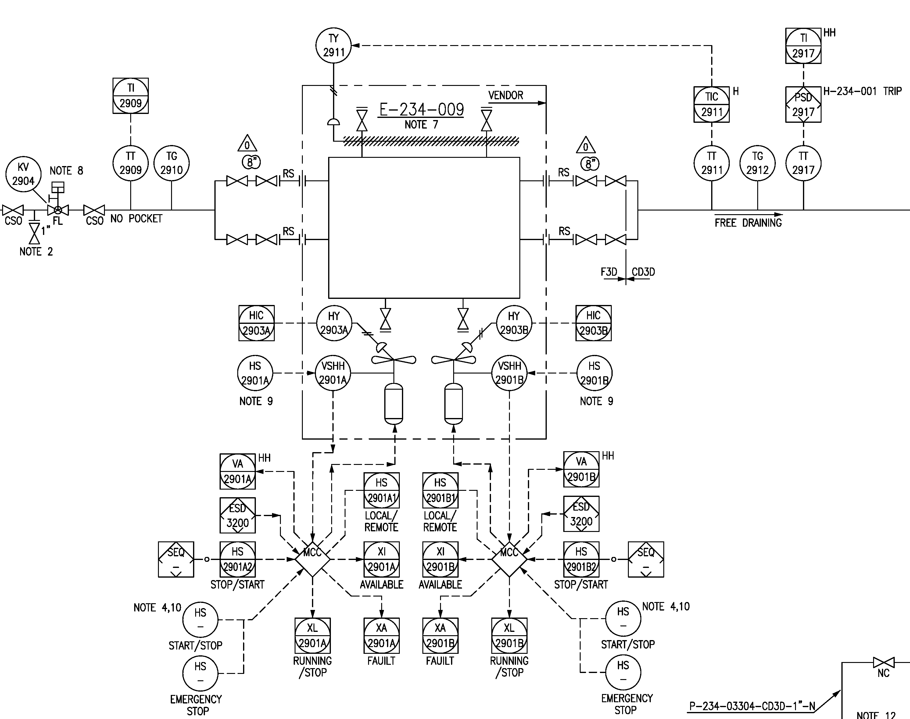

# LLM-based Code Generation using Image Recognition
This repositories contains Piping-and-Instrumentation Diagrams (P&ID) and ChatGPT chatlogs from sessions generating [IEC 61131-3](https://en.wikipedia.org/wiki/IEC_61131-3) [Structured Text](https://en.wikipedia.org/wiki/Structured_text) code from them using [GPT-4V](https://openai.com/blog/chatgpt-can-now-see-hear-and-speak). The chatlogs contain prompts for explaining the P&IDs, describing their topological structure, and synthesizing control logic from them.

## Eastman Chemical
A process plant of Eastman Chemical Company, US, was previously subject to a plant-wide disturbance analysis. The available P&ID drawing contains three distillation columns, two decanters, and several recycle streams. The specified process also includes 14 controlled actuators and 15 indicators, e.g., for temperature, pressure, and level.

[Eastman Chatlog](eastman-chatlog.mhtml)

## DEXPI

DEXPI stands for ``Data Exchange in the Process Industry'' and has recently become a registered association for developing and promoting common data standards for chemical process plants. Large chemical companies, such as BASF, Equinor, or Shell, are members of this initiative, as well as vendors of popular CAD applications. The organization has specified an exemplary P&ID for testing data exchange. The diagram uses the ISO 10628 notation and includes detailed pipe and equipment nozzle labels, as well as a few tables with equipment design parameters (e.g., maximum temperature for a tank or dimensions). The process contains one large tank, two pumps, two heat exchanges, and four instruments. It does not depict a real process, but was condensed to include many P&ID elements to test DEXPI importers and exporters.

[DEXPI Chatlog](dexpi-chatlog.mhtml)

## Butane Regeneration
The third case tackles generating control logic for a butane regeneration air and water cooling system. A Korean engineering company provided the P&ID drawing, which was used in 2019 for a study on symbol and text recognition for P&IDs based on template matching. Butane is a gas often used as fuel for portable lighters and the manufacturing of a wide range of chemicals. The specified process contained two water coolers, one air cooler with two fans, and a lot of instrumentation mostly for temperature and pressure.

[Butane Regeneration Chatlog](butane-chatlog.mhtml)